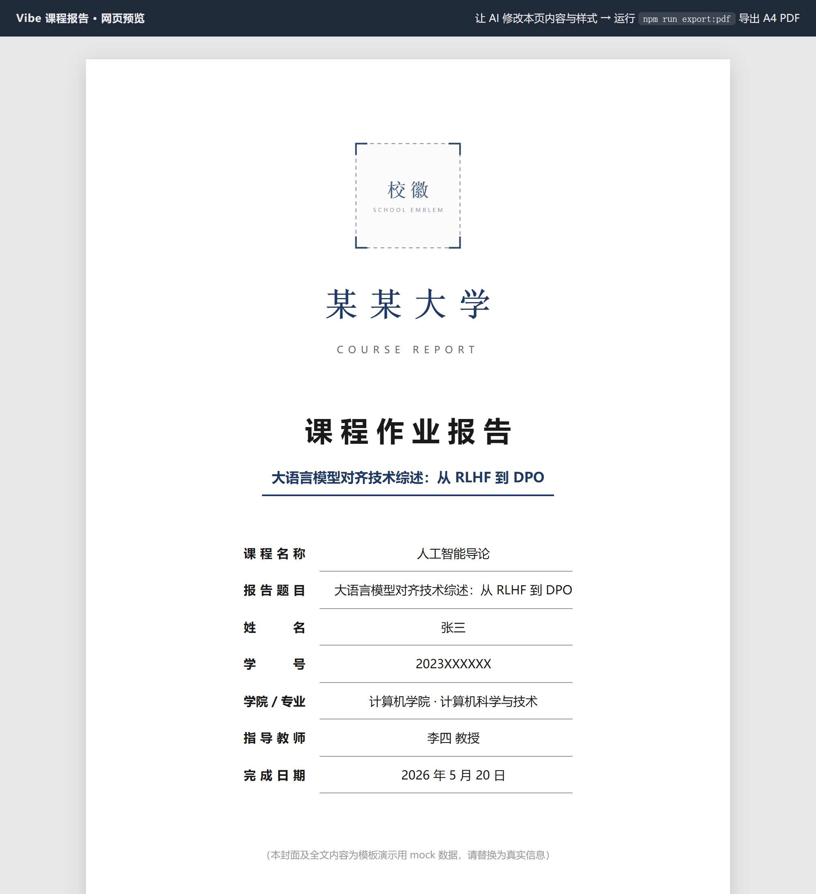

# VibeCourseReport · Vibe 课程报告

> 像 vibe coding 一样写课程作业报告：告诉 AI 你要写什么，它直接修改网页报告，再一键导出为 A4 多页 PDF。

VibeCourseReport 是一个 **AI 友好、网页优先、可导出多页 PDF 的大学课程作业报告模板**，灵感与思路来自 [vibe-resume](https://github.com/LiuMengxuan04/vibe-resume)。你不需要在 Word 里反复调封面、目录和页码；把报告维护成 `HTML + CSS`，让 AI 帮你改内容和排版，然后用脚本把网页看到的布局稳定导出成 A4 PDF。

- 示例网页：打开 `index.html`
- 示例 PDF：运行 `npm run export:pdf` 后生成于 `export/vibe-course-report-demo.pdf`
- AI 使用说明：`skills/vibe-report-editor/SKILL.md`

## 为什么做这个项目

写课程报告经常卡在三个地方：

- 报告内容想让 AI 写/改，但 Word / LaTeX 不适合 AI 直接编辑。
- 封面、目录、页码、图表编号这些"格式活"比写内容还耗时。
- 网页看起来正常，浏览器"打印成 PDF"后分页却错位。

VibeCourseReport 的思路是：**把网页作为报告源文件，把 AI 当作作者兼排版师，把 PDF 当作构建产物。**

## 核心特点

- **像 vibe coding 一样写报告**：直接告诉 AI 课程名称、报告主题、章节要求和字数，让它修改 `index.html` 与 `styles.css`。
- **完整学术结构**：封面（课程/姓名/学号/指导教师）、摘要 + 关键词、目录、章节正文、三线表、插图、公式、GB/T 7714 参考文献。
- **目录页码自动计算**：导出脚本按真实分页位置回填目录页码，不用手填。
- **一键导出多页 A4 PDF**：Chromium 渲染 `screen` 布局，按 A4 自动分页，页脚自动加页码。
- **避免打印错位**：不依赖手动浏览器打印，不触发不可控的 `@media print` 差异。
- **AI 配套 Skill**：仓库内置 `vibe-report-editor`，可作为 Codex-style skill 即插即用。



> 截图与模板不同步时，运行 `npm run screenshot` 重新生成（输出到 `assets/preview.png`）；`npm run check` 会自动校验截图是否过期。

## 快速开始

安装依赖（需要 Node.js ≥ 18 和本机 Chrome / Chromium）：

```bash
npm install
```

本地预览：

```bash
npm run preview
# 然后访问 http://localhost:4173
```

导出 PDF：

```bash
npm run export:pdf
# 默认输出 export/vibe-course-report-demo.pdf
```

也可以指定输出路径：

```bash
node scripts/export-pdf.mjs export/自定义文件名.pdf
```

如果脚本找不到浏览器，手动指定 Chrome / Chromium：

```bash
CHROME_PATH=/path/to/chrome npm run export:pdf
```

> ⚠️ **安全提示**：Linux 环境下导出脚本会自动添加 `--no-sandbox` 参数以兼容 Docker/CI 等无头环境。该参数会禁用 Chromium 沙箱隔离，**仅用于渲染受信任的本地 HTML 内容**，切勿用来加载不可信的远程 URL。

## 推荐工作流

1. 把课程名称、报告主题、老师的要求（字数、章节、格式）和你的素材告诉 AI。
2. 让 AI 直接修改 `index.html`：替换封面信息、撰写摘要与正文、整理参考文献。
3. 让 AI 调整 `styles.css`：字号、行距、页边距、标题样式、学校主题色（`--accent`）。
4. 把图表截图或数据给 AI，让它生成图片放进 `assets/` 并在正文中引用。
5. 运行 `npm run export:pdf`，检查分页、目录页码和图表位置。
6. 不满意就把 PDF 截图发回给 AI 继续微调，形成闭环。

示例 prompt：

```
请基于这个模板帮我写《人工智能导论》课程报告，主题是"大语言模型对齐技术"。
要求：摘要 300 字左右，正文 4-6 节，至少一个三线表和一张图，参考文献按 GB/T 7714 格式，不要编造不存在的文献。
```

## AI Skill

仓库内置一个 Codex-style skill：

```
skills/vibe-report-editor/SKILL.md
```

安装到本机 Codex：

```bash
mkdir -p ~/.codex/skills
cp -R skills/vibe-report-editor ~/.codex/skills/
```

如果你的 AI 工具不支持 skills，直接把 `SKILL.md` 的内容粘贴到对话里作为项目说明即可。

## 页面几何约定

`styles.css` 与 `scripts/export-pdf.mjs` 中的页面参数必须保持一致（改动时两边同步）：

| 参数 | 值 | 说明 |
| --- | --- | --- |
| 纸张 | A4 (210 × 297mm) | 导出脚本中 `PAGE` |
| 上下边距 | 25mm | 页脚页码位于下边距内 |
| 左右边距 | 28mm | 对应 CSS `--margin-x` |
| 纸张宽 | 793.7008px | A4 210mm @96dpi 精确值（参与目录页码测量，勿取整） |

> 预览截图脚本 `scripts/update-preview.mjs` 的视口宽度运行时从 CSS 读取（`--sheet-w` + 2×`--margin-x`），不写死。

## 项目结构

```
.
├── assets/
│   ├── school-emblem.svg            # 封面校徽占位图（替换为真实校徽）
│   ├── figure-reward-accuracy.png   # 示例插图
│   ├── preview.png                  # README 预览截图（npm run screenshot 生成）
│   └── preview.sources.json         # 预览截图同步标记（npm run check 据此校验截图是否过期）
├── export/                    # 导出产物（被 .gitignore 忽略，运行 npm run export:pdf 后生成）
├── requirements/                    # 放入作业要求文件（PDF/Word 等），AI 用 markitdown 读取
├── skills/
│   └── vibe-report-editor/
│       └── SKILL.md                 # AI 编辑规则
├── scripts/
│   ├── export-pdf.mjs               # 多页 A4 导出脚本
│   ├── export-pdf-watch.mjs         # 导出 Watch 模式（源文件变化自动重新导出）
│   ├── update-preview.mjs           # README 预览截图生成（含 CJK 字体 / 缺失资源 / 构图校验）
│   ├── update-preview-watch.mjs     # 截图 Watch 模式（源文件变化自动重新生成截图）
│   └── lib/
│       └── chrome.mjs               # 共享 Chromium 探测与启动（export-pdf 与 update-preview 共用）
├── index.html                       # 报告源文件（内容）
├── styles.css                       # 报告源文件（样式）
├── package.json
└── README.md
```

## 为什么不直接用浏览器打印

浏览器打印会从 `screen` 媒体切换到 `print` 媒体，触发不同的纸张大小、分页、边距和字体渲染，导出的 PDF 经常和网页预览不一致。本项目的导出脚本强制使用 `screen` 布局，封面/摘要/目录在导出时固定各占一整页，正文按 A4 内容高度自然分页，并据此反算目录页码，因此 PDF 与网页预览保持一致。

## 示例内容声明

仓库中的报告内容是模板演示用 mock 数据：学校、姓名、学号、教师均为虚构占位；示例图由脚本生成的模拟数据绘制；参考文献为真实公开文献，仅用于演示 GB/T 7714 排版格式。封面上的校徽是正方形占位图，可从免费高校徽标库 [universitylogos.top](https://universitylogos.top/) 下载透明底 PNG/SVG 放入 `assets/`，再修改 `index.html` 中 `.cover-emblem > img` 的 `src` 即可替换（仅限本校课程报告等正当用途）。请在提交前全部替换为真实内容，并遵守课程关于 AI 工具使用的学术诚信要求。

## 致谢

灵感来自 [LiuMengxuan04/vibe-resume](https://github.com/LiuMengxuan04/vibe-resume)（MIT License）——"网页即源文件，AI 即编辑器，PDF 即构建产物"的工作流同样适用于课程报告。

## 开源协议

MIT
